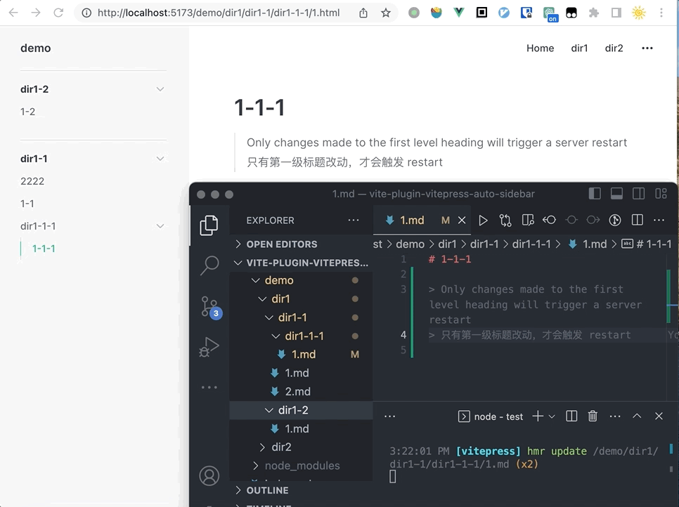

<h2 align='center'><samp>vitepress-plugin-auto-sidebar</samp></h2>

<p align='center'>自动生成 vitepress 的 sidebar</p>
<p align='center'>
  <a href='https://www.npmjs.com/package/@iminu/vitepress-plugin-auto-sidebar'>
    
  </a>
  <a href='https://github.com/mingyuLi97/vitepress-plugin-auto-sidebar/blob/master/LICENSE'>
    
  </a>
</p>

<p align="center">
  
</p>

## 功能

- 🪄 自动生成 sidebar
- ✨ 将文件一级标题自动同步到 sidebar
- 🚀 当文件删除、修改名称时自动同步到 sidebar
- ✔️ 支持对产生的 sidebar 配置做自定义修改（改名称、排序...）

## 安装

```bash
# pnpm
pnpm i @iminu/vitepress-plugin-auto-sidebar
# yarn
yarn add @iminu/vitepress-plugin-auto-sidebar
# npm
npm install @iminu/vitepress-plugin-auto-sidebar
```

## 使用

```ts
// .vitepress/config.ts
import AutoSidebar from "@iminu/vitepress-plugin-auto-sidebar";
export default defineConfig({
  vite: {
    plugins: [
      AutoSidebar({
        /**
         * after resolve, we can change it
         */
        sidebarResolved(value) {
          // do sort
          value["/dir2/"][0].items?.sort((a, b) => a.text - b.text);
          // rename
          value["/dir2/"][0].text = "sorted";
        },
        ignores: ["index.md"],
        // Which files are included
        docs: path.resolve(process.cwd(), "docs/demo"),
        /**
         * .vitepress parent folder
         */
        root: path.resolve(process.cwd(), "docs"),,
      }),
    ],
  },
});
```

## 原理

更多原理见 [🌟 Vitepress 侧边栏自动生成，让你更专注写作](https://juejin.cn/post/7227358177489961018/)

```
├── .vitepress
├── dir1
│   ├── dir1-1
│   │   ├── 1.md
│   │   ├── 2.md
│   │   └── dir1-1-1
│   │       └── 1.md
│   └── dir1-2
│       └── 1.md
├── dir2
│   └── 2-2
│       ├── 2.md
│       └── 3.md
├── index.md
├── node_modules
└── package.json

TO


{
  "/dir2/": [
    {
      "text": "2-2",
      "collapsed": false,
      "items": [
        {
          "text": "2-2",
          "link": "/dir2/2-2/3.md"
        },
        {
          "text": "222",
          "link": "/dir2/2-2/2.md"
        }
      ]
    }
  ],
  "/dir1/": [
    {
      "text": "dir1-2",
      "collapsed": false,
      "items": [
        {
          "text": "1-2",
          "link": "/dir1/dir1-2/1.md"
        }
      ]
    },
    {
      "text": "dir1-1",
      "collapsed": false,
      "items": [
        {
          "text": "2222",
          "link": "/dir1/dir1-1/2.md"
        },
        {
          "text": "1-1",
          "link": "/dir1/dir1-1/1.md"
        },
        {
          "text": "dir1-1-1",
          "collapsed": false,
          "items": [
            {
              "text": "1-1-1",
              "link": "/dir1/dir1-1/dir1-1-1/1.md"
            }
          ]
        }
      ]
    }
  ]
}
```
